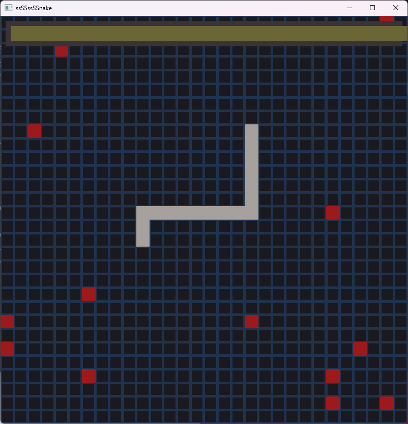

# Overview
This is a really boring rendition of the classic arcade game *Snake*. It's just a simple 2d engine using OpenGL and GLFW. For building convenience, the project includes the libs and headers necessary to build the project. The gameplay code was *NOT* the focus of this project, so there are some bugs that I didn't care to fix. I was just focused on learning basic rendering code.

## Build
This project doesn't have any dependencies that aren't typically on a standard windows install. To build the program, you need the msvc compiler for now, but supporting other compilers is fairly trivial. Just *cd* to the project root directory and call *build.bat*. You need the msvc environment variable non-sense, so edit the command below to your *vcvarsall.bat* path.

```
call "C:\Program Files\Microsoft Visual Studio\2022\Community\VC\Auxiliary\Build\vcvarsall.bat" x64 && build.bat
```

## Running the Program
There should be *snake.exe* and *snake.dll* in the build folder. Go into that folder and run the executable.
### Controls
- Move with Arrow Keys
- Stop time with Space Bar

